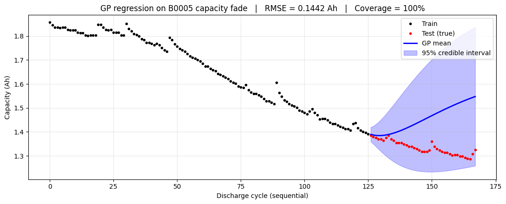
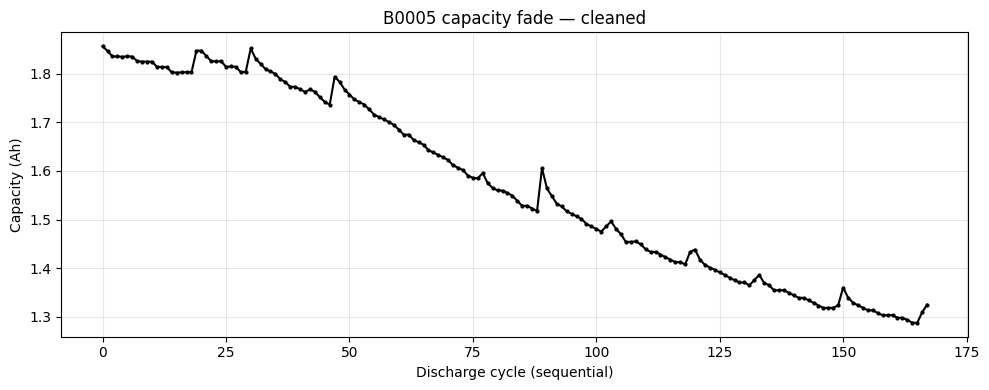

# Gaussian Process Regression for Battery Capacity Fade Prediction

A small, self-directed project applying Gaussian Process (GP) regression to
predict capacity fade in a Li-ion battery, with a focus on **uncertainty
quantification** and **honest evaluation on a held-out future segment**.

The project was built as hands-on preparation for a PhD application in
probabilistic machine learning for battery state estimation.

---

## Goal

Predict the **capacity** (in Ah) of a Li-ion battery over its discharge
lifetime using a Gaussian Process, and quantify how confident the model is
about each prediction via a 95% credible interval.

---

## Data

**NASA Prognostics Center of Excellence — Battery Dataset (B0005).**

- One battery cell.
- **168 discharge cycles** after cleaning.
- Each cycle contains ~300 time samples of voltage, current, temperature,
  and load measurements.
- The prediction target is **capacity per cycle** — a single scalar per
  discharge, computed as the integral of current over the discharge.

> **Note on the raw data:** In the flattened CSV, `Capacity` appears only on
> the first row of each cycle (the rest are `NaN`). This is because capacity
> is a per-cycle summary, not a per-sample measurement. The pipeline extracts
> the single valid value per cycle using a `first_valid` reduction.

---

## Method

1. **Cleaning**
   - Extract one capacity value per discharge cycle via `first_valid`.
   - Drop cycles with missing or non-positive capacity.
   - Drop aborted cycles (< 100 samples).
   - Re-index cycles to a clean sequential counter (0, 1, 2, …) so the GP
     length-scale is interpretable as "number of discharge cycles".

2. **Time-aware split**
   - 75% train / 25% test **by cycle order**, not shuffled.
   - Train on early-life cycles, test on a **held-out future segment**.
   - This avoids leakage between correlated samples within the same cycle.

3. **Model**
   - Kernel: `ConstantKernel × Matérn(ν=1.5) + WhiteKernel`
   - Hyperparameters optimised by maximising the log marginal likelihood
     (10 random restarts).
   - `normalize_y=True` for numerical stability.

4. **Baseline**
   - Random Forest Regressor (200 trees) — a point-prediction baseline
     with no native uncertainty.

---

## Results

Metrics on the held-out future segment (42 cycles):

| Model         | RMSE (Ah) | 95% Coverage | Mean interval width (Ah) |
|---------------|-----------|--------------|--------------------------|
| Gaussian Process | 0.1442 | 100.0% | 0.3852 |
| Random Forest    | 0.0662 | —      | —      |

**Interpretation.** The GP produces a smooth mean prediction but
**over-wide predictive intervals** — coverage of 100% with an average width
of ~0.385 Ah (roughly 75% of the total capacity range). Its RMSE is also
**more than 2× higher** than the Random Forest baseline. This is the
characteristic signature of a **single stationary kernel** trying to fit a
**non-stationary** degradation process: the fade curve changes slope over
the battery's lifetime, and one length-scale cannot capture both regimes.
The GP hedges by widening its intervals.

This is not a bug — it is a real limitation of single-layer GPs on
non-stationary time series, and it directly motivates the **Deep Gaussian
Process** approach: composing multiple GP layers allows the model to learn
a hierarchy of non-linear representations that can represent regime
changes.

---

## Main figure

The blue band is the GP's 95% credible interval on the test segment. Its
width illustrates the model's uncertainty and the limitation described
above.

Cleaned raw data: capacity fade over 168 discharge cycles.
---

## What this project demonstrates

- Correct use of a GP for regression with predictive uncertainty.
- Kernel selection and justification (Matérn 3/2 for finite smoothness;
  WhiteKernel for observation noise).
- Hyperparameter optimisation via marginal likelihood maximisation.
- A time-aware evaluation protocol that avoids information leakage.
- Honest reporting of a model that underperforms a baseline, with
  interpretation tied to the underlying modelling assumption.

---

## Limitations

- Only one battery (B0005); no cross-cell generalisation tested.
- Single input feature (cycle number); voltage/current/temperature signals
  were not used as covariates.
- Stationary kernel assumption is violated by the fade dynamics.
- No sparse or variational GP; exact inference only, feasible here because
  n ≈ 168.

